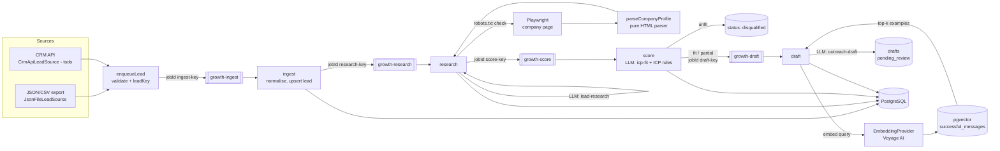

# AI Growth Engineer Pipeline

Ingest leads, research them with an LLM, score them against your ideal customer profile, and draft personalised outreach only for the ones worth contacting.

> Status: **scaffold**. The pipeline stages, contracts and tests are in place and run offline. It has not yet been run against real leads, and none of the numbers below have been measured. See [Roadmap](#roadmap).

## Why this exists

Qualifying outbound leads by hand is slow and inconsistent: someone opens each company's website, decides whether it matches the ICP, then writes an email from scratch. This pipeline automates the research and first-draft work and leaves the judgement calls to a person. A deterministic ICP rule layer sits on top of the model's verdict, and every draft waits in `pending_review` until a human approves it.

## Architecture



**Stages are BullMQ queues in code**, one per stage, so each can be scaled, retried and inspected independently. The original design mentioned n8n for orchestration; it's optional. n8n could trigger `npm run ingest` or post leads to a future HTTP endpoint, but the retry and idempotency rules belong in code, where they're tested.

**Two-stage LLM logic.** Every model call goes through `LlmClient.structured` (`src/llm/client.ts`) with a Zod schema:

| Task | Schema | Purpose |
|---|---|---|
| `lead-research` | `{ summary, signals[], unknowns[] }` | Condense lead record + company page into evidence |
| `icp-fit` | `{ verdict: 'fit' \| 'partial' \| 'unfit', reasons[], matchedCriteria[] }` | Stage 1: qualify. `matchedCriteria` is an enum of the ICP's own criterion ids |
| `outreach-draft` | `{ subject, body, personalisationPoints[] }` | Stage 2: only runs for `fit` / `partial` |

**Layout**

```
src/
  pipeline/handlers.ts      one pure-ish function per stage (no BullMQ), plus runInline
  pipeline/stages/          ingest, research, score (incl. applyIcpRules), draft (incl. shouldDraft)
  pipeline/schemas.ts       LLM output contracts
  pipeline/prompts.ts       prompt builders (scraped text fenced as untrusted)
  pipeline/queues.ts        queue names, retry policy, enqueueLead
  pipeline/workers.ts       BullMQ workers, retry classification
  pipeline/idempotency.ts   lead key normalisation, job ids
  scraper/                  Playwright source, pure HTML parser, robots.txt evaluator
  sources/lead-source.ts    LeadSource interface + JSON file source
  embeddings/provider.ts    EmbeddingProvider interface (+ Voyage stub)
  db/                       repository interface + Postgres implementation
migrations/001_init.sql     leads, research, verdicts, drafts, successful_messages (vector(1024))
```

## Data collection: what this does and does not scrape

- **Do not scrape LinkedIn** or any site whose terms prohibit automated access. This project does not, and no LinkedIn source will be added.
- Lead records come from data you're allowed to use: your CRM, sign-up lists, or permitted vendor APIs (`LeadSource`).
- The research step loads only the **company's own public page** (the lead's `websiteUrl` or company homepage). Before each load, `PlaywrightProfileSource` fetches `robots.txt` and refuses disallowed paths. If `robots.txt` can't be read (anything other than 404/410), it doesn't fetch the page. It sends an identifying `SCRAPER_USER_AGENT` with a contact URL.
- Stick to each site's terms of service and to data-protection law (e.g. GDPR legitimate-interest assessment for B2B outreach) in your jurisdiction.

## Failure handling

| Concern | What happens |
|---|---|
| **Transient failures** (rate limits, network, Redis blip) | Each job gets 4 attempts with exponential backoff starting at 5 s (`DEFAULT_JOB_OPTIONS`). |
| **Permanent failures** | `InvalidLeadError`, `MissingRecordError` and LLM safety refusals are converted to BullMQ `UnrecoverableError`, so they go straight to the failed set instead of retrying (`isPermanent`, tested). |
| **Dead letters** | Failed jobs are never removed (`removeOnFail: false`). Once a lead's attempts run out, its status becomes `failed` and `last_error` is set, so it can be found and replayed. |
| **LLM output validation** | Every response is parsed against a Zod schema, both by the SDK and again in `LlmClient`. Drift (unknown verdict label, an invented criterion id, empty reasons, unfilled `{{placeholders}}`, an over-long subject) throws, which fails and retries the job. Nothing unvalidated is stored. |
| **Model judgement guardrail** | `applyIcpRules` downgrades a `fit` that doesn't cite every *required* ICP criterion to `partial`. Code enforces the hard requirements; the model's opinion doesn't override them. |
| **Fallbacks** | If the company page can't be fetched (robots, timeout, HTTP error), research continues from the lead record alone and the model is told the page was unavailable. If embeddings or example retrieval fail, or no Voyage key is configured, drafting proceeds without examples. The server-side model fallback in `LlmClient` covers classifier refusals. |
| **Prompt injection** | Scraped text and lead fields are wrapped in `<untrusted>` tags, and system prompts tell the model to ignore any instructions inside them. Drafts are never sent automatically. |
| **Idempotency** | A lead's identity is its lowercased email, or else its normalised domain + name, hashed to a 32-hex `leadKey` (no PII in Redis keys). The BullMQ jobIds are `<stage>-<leadKey>`, so re-submitting a lead, or a retried parent re-enqueuing its child, is a no-op. All DB writes are upserts keyed by `leadKey`. A duplicate ingest stops the pipeline unless the lead is still at `ingested` (a crash between insert and enqueue), in which case it resumes. Drafts already reviewed by a human are never overwritten. |
| **Shutdown** | SIGTERM/SIGINT call `Worker.close()`, which waits for in-flight jobs. |

Known gap: ingest job payloads (raw lead records, including emails) are stored in Redis until the job is cleaned up. Treat Redis as holding PII.

## Testing

Tests are a first-class part of this project. `npm test` runs fully offline: no API key, Postgres or Redis needed. The LLM is replaced by `FakeLlm` (`test/fakes.ts`), which still parses every response through the production schema, so contract tests exercise the same validation path as production.

| Test file | What it proves |
|---|---|
| `scraper-parser.test.ts` | `parseCompanyProfile` against fixture HTML (`test/fixtures/`): snapshot plus explicit assertions for JSON-LD precedence, malformed JSON-LD fallback, script/footer stripping, social links, careers detection |
| `robots.test.ts` | robots.txt groups, specific-agent precedence, longest-match, `*` and `$` wildcards |
| `idempotency.test.ts` | email/domain/name normalisation, stable keys, no PII in keys, BullMQ-safe job ids |
| `icp-fit.test.ts` | `icp-fit` contract, drift rejection (5 cases), required-criteria downgrade, untrusted fencing |
| `outreach-draft.test.ts` | `outreach-draft` contract, drift rejection (5 cases), drafting gate, **no model call for `unfit`** |
| `pipeline.test.ts` | all stages through `runInline` with in-memory repo: fit → drafted with examples; unfit → disqualified with no draft call; duplicate handling; crash-resume; page-fetch fallback; no-embeddings fallback; retry classification |
| `llm-contract.test.ts` | the kernel's schema-or-throw guarantee |
| `integration/pg-repository.test.ts` | real Postgres + pgvector upserts and similarity query. **Skipped unless `INTEGRATION=1`** |

```bash
npm test                  # offline unit + contract tests
npm run typecheck
npm run test:integration  # needs docker compose up + npm run migrate
```

## Running locally

Prerequisites: Node 22+, Docker.

```bash
npm install
npx playwright install chromium        # browser for the research stage
cp .env.example .env                   # set ANTHROPIC_API_KEY (and VOYAGE_API_KEY once implemented)
docker compose up -d                   # pgvector/pgvector:pg17 + redis:7
npm run migrate                        # applies migrations/*.sql
npm run dev                            # starts the four stage workers
npm run ingest -- examples/leads.sample.json   # in another terminal
```

Then inspect results:

```sql
SELECT l.full_name, v.verdict, v.reasons, d.subject
  FROM leads l LEFT JOIN verdicts v USING (lead_key) LEFT JOIN drafts d USING (lead_key);
```

The sample file uses reserved `.example` domains, so the research stage falls back to lead-only research for them. Use your own permitted leads for a real run. Copy `config/icp.example.json`, edit it to describe your ICP, and point `ICP_PATH` at it.

Container: `docker compose --profile worker up --build` runs the workers from the multi-stage `node:22-alpine` image. That image uses Alpine's Chromium because Playwright doesn't ship musl builds; switch to the official Playwright image if rendering misbehaves.

## Results

Nothing has been measured yet. This table records what will be measured and how.

| Metric | Value | How it will be measured |
|---|---|---|
| Time to process 100 leads (ingest → draft) | not yet measured | `npm run benchmark -- 100` → `reports/benchmark.json` (wall clock from enqueue to last terminal status) |
| Per-stage latency p50/p95 | not yet measured | BullMQ job `processedOn`/`finishedOn` per queue |
| LLM cost per qualified lead | not yet measured | token usage from responses × model pricing |
| Verdict agreement with a human reviewer | not yet measured | hand-label ~50 leads, compare `icp-fit` verdicts (precision/recall on `fit`) |
| Draft acceptance rate | not yet measured | share of `pending_review` drafts approved without edits |
| Schema-drift / retry rate | not yet measured | failed-attempt counts per task from worker logs |

**Target (not achieved, not measured):** the original plan aims to cut manual research for 100 leads from ~12 hours to ~20 minutes of pipeline time plus human review.

## Roadmap

Scaffolded:
- [x] Stage handlers (ingest, research, score, draft) as plain functions, with an inline runner
- [x] BullMQ queues and workers, retry/backoff policy, permanent-error classification, deterministic job ids
- [x] Zod contracts for `lead-research`, `icp-fit`, `outreach-draft`, plus ICP rule guardrail
- [x] Postgres schema with pgvector column and HNSW index, Postgres repository, migration runner
- [x] Pure company-page parser + robots.txt evaluator, Playwright fetch with robots check
- [x] `LeadSource` interface + JSON file source; `EmbeddingProvider` interface
- [x] Offline test suite (fakes for LLM, embeddings, repository, page source); gated integration test
- [x] docker-compose, Dockerfile, `.env.example`

To do:
- [ ] `VoyageEmbeddingProvider.embed` (HTTP call, batching, 429 retry)
- [ ] Script to seed `successful_messages` from past campaigns (embed + insert)
- [ ] `runSeededBatch` in `scripts/benchmark.ts` (QueueEvents-based completion tracking) and first real measurement
- [ ] Token usage exposed from `LlmClient` for cost reporting
- [ ] Redis + BullMQ end-to-end integration test
- [ ] `CrmApiLeadSource` against a permitted CRM API
- [ ] Review UI or CLI for approving / editing drafts; replay command for `failed` leads
- [ ] Eval set: hand-labelled leads to track verdict quality across prompt and ICP versions
- [ ] Optional n8n workflow that triggers ingest on a schedule
