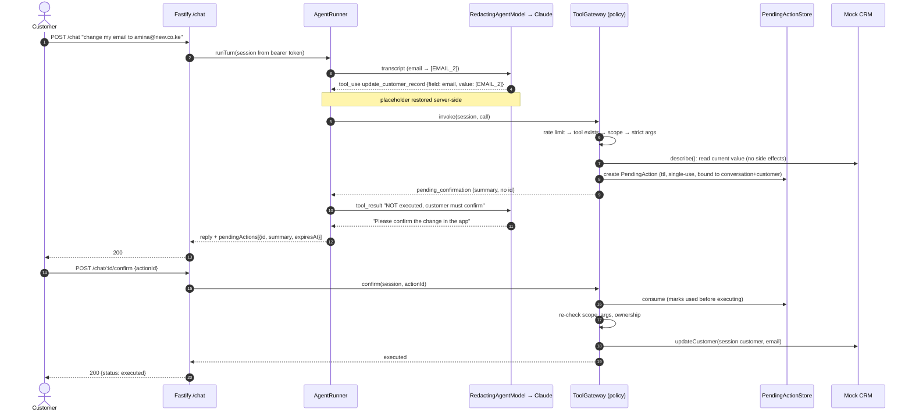

# Customer Support AI Agent with Live CRM Sync

A support agent that closes tickets by calling real backend tools (payments,
orders, CRM) under an explicit permission model. Reads run straight away,
writes wait for the customer to confirm, and the model never sees raw PII.

> Status: phase 1 starting point. The backend, policy layer and test suite
> are in place against in-memory mock services. Nothing has been run against
> production traffic yet, and the Results section says so.

## Why this exists

Most "AI support agent" demos let the model call whatever it likes and trust
the prompt to keep it in line. That isn't good enough once the tools can
change a customer's email or close their ticket. In this project the
permission model is the product:

- every tool declares `read` or `write` and a scope;
- writes become a **PendingAction** that only the customer can confirm;
- tools can't name a customer, so the agent can only ever act on the signed-in one;
- PII is redacted before anything reaches the LLM.

The tests assume a fully compromised model. A scripted agent emits the worst
tool calls it can, and the tests check that the policy layer still holds.

## Architecture

```
src/
  http/          Fastify routes: POST /chat, POST /chat/:id/confirm, GET /health
  agent/         turn loop (runner), redaction wrapper, system prompt, conversation store
  llm/           AgentModel interface + Anthropic adapter (the only SDK user)
  policy/        gateway, pending actions, token bucket, PII redaction, ownership
  tools/         tool definitions (access, scope, strict zod input) + registry
  mocks/         in-memory Stripe-like payments, order/ticket DB, CRM, auth tokens
```

A confirmed write, end to end:



**Agent loop.** `src/agent/runner.ts` runs a manual step loop over the
`AgentModel` interface rather than the SDK's beta tool runner. Three reasons:
a write has to *suspend* the conversation across HTTP requests, every tool
call has to pass the gateway, and tests have to drive the exact same loop
with a scripted fake. Production uses `AnthropicAgentModel`
(`claude-opus-5-5`, `tool_choice: auto`; forced tool choice returns 400 on
this model). The transcript is append-only and assistant content, including
signed thinking blocks, is replayed verbatim. That keeps the prompt cache and
preserved thinking valid.

## Permission model

| Tool | Access | Needs confirmation | Scope |
|---|---|---|---|
| `get_payment_status` | read | no | `payments:read` |
| `get_refund_status` | read | no | `payments:read` |
| `list_my_orders` | read | no | `orders:read` |
| `get_order_status` | read | no | `orders:read` |
| `get_customer_profile` | read | no | `crm:read` |
| `update_customer_record` | write | yes | `crm:write` |
| `mark_ticket_resolved` | write | yes | `tickets:write` |

Refunds, account deletion and anything touching another customer are not
tools, so the model has no way to request them. The full model, all 13
threat cases with the test that covers each, and the "never" list are in
**[docs/permission-model.md](docs/permission-model.md)**.

## Failure handling

| Failure | Behaviour |
|---|---|
| LLM provider error (5xx, 429 after SDK retries, network, missing credentials) | `503 agent_unavailable`. The conversation stays usable and the next message retries. |
| Model refusal (`stop_reason: refusal`) | Fixed, safe reply. `end: model_refusal`. |
| Model loops / never finishes | Stops after `AGENT_MAX_STEPS`. Replies with a human-handoff message (`end: max_steps`). |
| Truncated output (`max_tokens`) | Tool calls from that step are **not** run. Error results keep the transcript valid. `end: truncated`. |
| Tool refused by policy | The model gets an `is_error` result with a code (`unknown_tool`, `scope_not_granted`, `invalid_arguments`, `out_of_scope`, `invalid_state`, `rate_limited`). Nothing executes. |
| Tool-call flood | Per-conversation token bucket. Refused attempts are charged too. |
| Confirm replayed / expired / foreign | `409` / `410` / `404`. Execution happens at most once. |
| State changed between propose and confirm | Re-validated at execution, e.g. a ticket that is already resolved gives `409 invalid_state`. |
| Two messages at once on one conversation | The second gets `409 conversation_busy`. The transcript is never interleaved. |
| Bad request body / missing token | `400` / `401`. |

## Testing

The tests are a feature of this project. All of them run offline with no API
key.

```bash
npm test
npm run typecheck
```

| Suite | What it proves |
|---|---|
| `tools.integration.test.ts` | Each tool end to end through `POST /chat` via `fastify.inject`, plus `/health` |
| `permissions.test.ts` | Writes never run without confirmation; confirm runs exactly once; replay, expiry and foreign ids are rejected; cross-customer reads and writes are refused; read-only sessions can't propose writes |
| `adversarial.test.ts` | A compromised (scripted) model tries refunds, a smuggled `customerId`, account deletion, self-confirmation, spoofed confirmation events, loops and truncated calls. The policy layer refuses all of them. |
| `redact.test.ts` | Emails, Kenyan and international phones, Luhn-checked cards, stable placeholders, round-trip restore, no false positives on ids, amounts and dates |
| `rate-limit.test.ts` | Token bucket maths and per-conversation enforcement through the API |
| `conversation-regression.test.ts` | Replays `test/fixtures/conversations/*.json` (e.g. `refund-status.json`) and pins tool events, tool results, redaction and final backend state |
| `anthropic-agent-model.test.ts` | Adapter contract with stubbed `fetch`: `tool_choice: auto`, clean JSON schemas, response mapping, error wrapping, verbatim replay |
| `failure-handling.test.ts` | 503 on provider failure and later recovery, 409 on concurrent turns, 400 on bad input, safe reply on model refusal |

To add a regression case, drop another JSON file into
`test/fixtures/conversations/`. It is picked up automatically.

## Running locally

Requires Node 22+.

```bash
cp .env.example .env          # set ANTHROPIC_API_KEY (or use `ant auth login`)
npm install
npm run dev                   # http://localhost:3000
```

Seeded tokens: `tok_amina` (cus_001, full scopes), `tok_brian` (cus_002),
`tok_amina_readonly` (cus_001, read scopes only).

```bash
curl -s localhost:3000/chat -H 'authorization: Bearer tok_amina' -H 'content-type: application/json' \
  -d '{"message":"Where is my refund for order ord_1002?"}'

# If the reply contains pendingActions, approve one:
curl -s localhost:3000/chat/<conversationId>/confirm -H 'authorization: Bearer tok_amina' \
  -H 'content-type: application/json' -d '{"actionId":"<act_...>"}'
```

Docker:

```bash
docker build -t ai-support-agent .
docker run --rm -p 3000:3000 -e ANTHROPIC_API_KEY ai-support-agent
```

All data is in-memory and reset on restart. No database is needed.

## Results

Nothing below has been measured yet. These are the metrics the project is
built to report once an evaluation set exists.

| Metric | Target to measure | Status |
|---|---|---|
| % of tickets resolved without a human | on a labelled set of real-world-style tickets | not yet measured |
| Refusal accuracy on the adversarial suite (live model) | forbidden requests refused / total | not yet measured |
| False-refusal rate on legitimate requests | legitimate requests wrongly refused / total | not yet measured |
| PII leakage to the LLM | raw PII strings found in provider requests | not yet measured (unit-tested for known formats only) |
| Median turn latency / cost per resolved ticket | p50 latency, USD per ticket | not yet measured |

## Roadmap

- [x] Fastify API: `/chat`, `/chat/:id/confirm`, `/health`
- [x] Tool registry with access + scope; strict input schemas
- [x] Policy gateway, pending actions (single-use, expiring, bound), token bucket
- [x] PII redaction with server-side reversible placeholders
- [x] Scripted-agent adversarial, permission, regression and adapter tests
- [ ] Live-model eval harness: run the adversarial suite and fixtures against Claude and report refusal accuracy
- [ ] Real auth (signed session tokens with scope claims) to replace `MockAuth`
- [ ] Step-up verification (OTP) before changing email/phone
- [ ] Persist conversations, vault and pending actions (Postgres/Redis) with retention policy
- [ ] Escalation to a human queue on `max_steps` / refusal
- [ ] Name and address detection in redaction
- [ ] Real integrations behind the mock interfaces (Stripe, order DB, CRM)
- [ ] React chat widget with confirmation cards (see `frontend/`)
