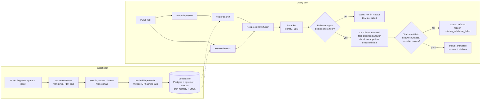

# RAG Knowledge Assistant with Evaluation Harness

Answers questions over a document corpus with mandatory, machine-verified citations, and ships with an automated evaluation harness that tells you whether a change made it better or worse.

## Why this exists

Most RAG demos stop at "it answered my question". The hard part of shipping one is knowing **when it is wrong**: when it cites a passage that doesn't say what it claims, answers from outside the corpus, or follows instructions planted in a document. This project treats those as first-class failure modes:

- every answer must cite retrieved chunks with verbatim quotes, and the server checks them before anything reaches the user;
- questions the corpus can't answer are stopped before the LLM is called;
- retrieved text is passed to the model as untrusted data;
- an eval harness with a golden dataset measures retrieval, citation, status (answer/decline/refuse) and faithfulness, and fails CI when a metric drops below its floor.

The sample corpus (`corpus/`) is a set of internal policies for **Larkspur Analytics, a fictional company**. One document contains a planted prompt injection so the defence is exercised on real data, not only in unit tests.

## Architecture



| Module | Responsibility |
|---|---|
| `src/ingest/` | `parser.ts` (pluggable `DocumentParser`; `PdfParser` is an explicit stub), `chunker.ts` (pure), `embeddings.ts` (`EmbeddingProvider`, `VoyageEmbedder`, `HashingEmbedder`), `pipeline.ts` |
| `src/store/` | `VectorStore` interface, `PgVectorStore` (pgvector + Postgres full-text), `InMemoryVectorStore` (exact cosine + `Bm25Index`) |
| `src/retrieval/` | `rrf.ts` (pure reciprocal rank fusion), `reranker.ts` (`IdentityReranker`, `LlmReranker`), `retriever.ts` (hybrid pipeline) |
| `src/answer/` | prompt construction, Zod output schema, `citation-validator.ts`, `ask-service.ts` |
| `src/eval/` | golden-set loader, pure metric functions, LLM judge, harness, report writer |
| `src/llm/client.ts` | the only place the Anthropic SDK is used |

**Embeddings.** Anthropic does not offer an embeddings API, so the intended production provider is Voyage AI (`voyage-3.5`, 1024 dimensions), called over its REST API behind `EmbeddingProvider`. The `HashingEmbedder` is a deterministic, lexical-only feature-hashing fake. It exists so tests and CI run without keys. It has no semantic understanding and should never be used for production retrieval.

## Evaluation harness

The harness is the main feature. It answers "did this change make the assistant better?" with numbers instead of anecdotes.

### What is measured

| Metric | Definition | Needs LLM |
|---|---|---|
| **Retrieval recall@k** | Share of an item's expected documents found in the top-k retrieved chunks (deduped to documents) | no |
| **Retrieval MRR** | Mean of 1 / rank of the first expected document | no |
| **Not-in-corpus gate accuracy** | Answerable items must pass the relevance gate, out-of-corpus items must be stopped by it | no |
| **Status accuracy** | `answered` / `not_in_corpus` / `refused` matches the expectation. Covers refusal of injection attempts. A crash counts as wrong | yes |
| **Citation correctness** | Share of the model's **raw** citations (before validation) that reference a retrieved chunk from an expected document and quote it verbatim. Scoring raw output means the validator can't hide hallucinations from the metric | yes |
| **Answer contains expected facts** | All `expectedAnswerContains` substrings present (case-insensitive) | yes |
| **Faithfulness** | LLM judge (`task: 'faithfulness-judge'`, Zod verdict `faithful` / `partially_faithful` / `unfaithful`, scored 1 / 0.5 / 0) against the chunks the answerer saw | yes |

Every metric function is pure and unit-tested (`test/metrics.test.ts`). Results are also broken down by tag (`single-doc`, `multi-doc`, `out-of-corpus`, `prompt-injection`, …).

### Golden dataset

`evals/golden.jsonl` has one item per line:

```json
{"id":"multi-001","question":"On a business trip to Zurich, what is my hotel cap and how much can I spend on meals per day?","expectedDocIds":["travel-policy","expense-policy"],"expectedAnswerContains":["$350","$75"],"expectStatus":"answered","tags":["answerable","multi-doc"]}
```

There are 29 starter items: 17 single-doc, 4 multi-doc/multi-section, 5 out-of-corpus (including a near-miss), 2 user prompt-injection attempts, and 1 question whose answer sits next to a planted document injection. **Target: 50–100 items**, grown from real user questions and from every production miss.

### How to run

```bash
npm run eval -- --offline                 # no keys: hashing embeddings, in-memory store, no LLM
npm run eval                              # live: Anthropic model + judge (+ Voyage if VOYAGE_API_KEY is set)
npm run eval -- --config rerank           # same, with the LLM reranker
npm run eval -- --k 10 --golden evals/golden.jsonl --out reports
```

- `--offline` runs retrieval and the gate for real and marks LLM-dependent metrics as `skipped`. Any attempted LLM call fails the run. This is what CI runs.
- `--config baseline|rerank` selects the identity or the LLM reranker. When the latest `baseline` and `rerank` reports for the same mode and dataset hash both exist, `latest.md` adds a before/after table with deltas.
- Evals always index the corpus into a fresh in-memory store, so results depend only on corpus + code + model.
- Floors live in `evals/thresholds.json`. If a measured metric falls below its floor, the run exits `1`. Skipped metrics are not checked.

### Report format

Each run writes `reports/eval-<timestamp>.json` (`reportVersion: 1`: run id, mode, config, git SHA, embedder/reranker/model, gate floor, dataset path + sha256, every metric with `n`, per-tag breakdown, threshold failures, and per-item retrieval/answer traces) and regenerates `reports/latest.md`:

```markdown
| Metric | Value | n | Floor | Result |
|---|---:|---:|---:|---|
| Retrieval recall@k | 0.979 | 24 | 0.85 | pass |
| Retrieval MRR | 0.958 | 24 | 0.7 | pass |
| Not-in-corpus gate accuracy | 0.926 | 27 | 0.85 | pass |
| Status accuracy (answered / not_in_corpus / refused) | — | 0 | 0.9 | skipped |
...
## Misses
| Item | Expected | Gate passed | Top cosine | Retrieved docs | Actual | Error |
| oos-001 | not_in_corpus | true | 0.158 | equipment-policy, ... | — |  |
```

## Failure handling

| Failure | Defence | Where |
|---|---|---|
| **Hallucinated citation** (chunk id not retrieved) | Rejected. The response becomes `status: "refused"`, `reason: "citation_validation_failed"`, and no answer text is returned | `src/answer/citation-validator.ts` |
| **Misquoted citation** (quote not in the chunk) | Rejected the same way. Matching is exact except for whitespace, and quotes under 12 characters are rejected so trivial strings can't "match" | same |
| **Answer without citations** | Rejected (`missing_citations`) | same |
| **Question not covered by the corpus** | If the best vector similarity is below the embedder's floor, the response is `status: "not_in_corpus"` **without calling the LLM**. The model can also decline (`reason: "model_declined"`) | `src/answer/ask-service.ts` |
| **Prompt injection in a document** | Retrieved text is wrapped in `<documents>` blocks that are declared untrusted. `<`, `>` and `"` are entity-escaped so a document can't close its tag and pose as instructions. The system prompt forbids following embedded instructions | `src/answer/prompt.ts`, `corpus/expense-policy.md` |
| **Prompt injection in the question** | The question is escaped too, and the model is instructed to return `refused` for requests to ignore the rules or the documents. Measured by `prompt-injection` items | same, `evals/golden.jsonl` |
| **Malformed model output** | `LlmClient.structured` validates against the Zod schema on both the provider side and ours, and throws `LlmOutputError` on refusal, truncation, or schema mismatch | `src/llm/client.ts` |
| **Sloppy reranker output** | Invented chunk ids are ignored and chunks the model forgot are kept, so the reranker can reorder but never drop | `src/retrieval/reranker.ts` |

Known limits: the gate floor is a single cosine threshold. The offline run shows it lets through 2 of 5 out-of-corpus questions that share generic words with the corpus ("company", "annual"). The Voyage floor (`0.35`) is an uncalibrated placeholder. Calibrating it from a live eval sweep is on the roadmap.

## Testing

```bash
npm run typecheck
npm test
npm run eval -- --offline
```

All tests run offline with `FakeLlm` (responses keyed by task and parsed through the real Zod schema) and the hashing embedder. Coverage:

- **chunker**: heading trail, fenced code, section boundaries, packing, sentence fallback, overlap, hard split, invalid options
- **RRF**: formula, ranks, single-list items, deterministic ties, duplicates
- **metrics**: recall@k, MRR, citation correctness, answer contains, status/gate, faithfulness mapping, mean
- **citation validator**: hallucinated ids, paraphrased quotes, case, whitespace, short quotes, missing citations
- **ask service**: not-in-corpus short-circuit makes zero LLM calls, valid answers, both rejection paths, model-declined answers
- **injection**: user injection is escaped and the refusal surfaces; the planted document injection stays inside `<documents>`; a document can't close its tag
- **reranker**, **embedders** (Voyage request shape via mocked `fetch`), **ingestion** (idempotent re-ingest, PDF stub), **HTTP API** (Fastify `inject`)
- **eval harness end-to-end**: offline run on the in-memory store meets the committed thresholds and writes JSON + markdown; live-mode scoring checked with a fake model and judge

`PgVectorStore` is **not** covered by the offline suite (see roadmap).

## Running locally

```bash
npm install
cp .env.example .env        # everything optional

# In-memory store, seeded from corpus/ at boot
npm run dev
curl -s localhost:3000/health
curl -s localhost:3000/ask -H 'content-type: application/json' \
  -d '{"question":"What is the daily meal allowance when travelling?"}'
```

`/ask` calls the model, so it needs `ANTHROPIC_API_KEY` (or an `ant auth login` profile) unless the gate short-circuits.

**With Postgres + pgvector:**

```bash
docker compose up -d db                    # pgvector/pgvector:pg17; migrations/ applied on first init
npm run migrate                            # idempotent
VECTOR_STORE=pg npm run ingest             # embeds + stores corpus/
VECTOR_STORE=pg npm run dev
```

Or run the API in a container with `docker compose --profile app up --build`, then ingest through `POST /ingest`:

```bash
curl -s localhost:3000/ingest -H 'content-type: application/json' \
  -d '{"documents":[{"source":"parking.md","content":"# Parking\nVisitor parking is on level 2."}]}'
```

API:

| Endpoint | Body | Response |
|---|---|---|
| `POST /ask` | `{ "question": string }` | `{ answer, citations: [{ chunkId, docId, quote }], status: "answered" \| "not_in_corpus" \| "refused", reason? }` |
| `POST /ingest` | `{ "documents": [{ "source": "name.md", "content": "..." }] }` | `{ documents: [{ id, title, chunks }], totalChunks }` |
| `GET /health` | | `{ status: "ok", chunks }` |

`/ingest` has no authentication. Add auth before exposing it beyond localhost.

## Results

**Not yet measured** against a live model and real embeddings. The table will be filled from `reports/` once live runs exist.

| Metric | Baseline (identity reranker) | LLM rerank |
|---|---|---|
| Retrieval recall@5 | not yet measured | not yet measured |
| Faithfulness | not yet measured | not yet measured |
| Citation correctness | not yet measured | not yet measured |
| Refusal / not-in-corpus accuracy | not yet measured | not yet measured |

The only numbers produced so far come from the **offline/fake-embedding smoke run** (`npm run eval -- --offline`: lexical hashing embedder, in-memory BM25, 29-item starter set, no LLM). They show that the pipeline and harness work, not how good the retrieval is: recall@5 0.979, MRR 0.958, gate accuracy 0.926 (25/27; two out-of-corpus questions got through the gate).

## Roadmap

- [x] Heading-aware chunker with overlap, hybrid retrieval with RRF, reranker interface
- [x] Citation validation, not-in-corpus gate, untrusted-data prompt framing
- [x] Eval harness: retrieval, gate, status, citation, faithfulness metrics; thresholds; versioned reports; baseline vs rerank comparison
- [x] Offline eval in CI
- [ ] First live eval run (Voyage + Claude); fill in Results
- [ ] Calibrate the relevance gate floor per embedder from an eval sweep
- [ ] Grow the golden set to 50–100 items (more paraphrases, multi-hop, adversarial injection variants)
- [ ] PDF parsing via `pdf-parse`/`unpdf` behind `DocumentParser`
- [ ] Integration tests for `PgVectorStore` with testcontainers; run evals against the pg store
- [ ] Batch inserts and an embedding cache keyed by chunk hash during ingest
- [ ] Repeat judge calls and report variance; spot-check judge agreement against human labels
- [ ] Auth on `/ingest`, rate limiting, request tracing
