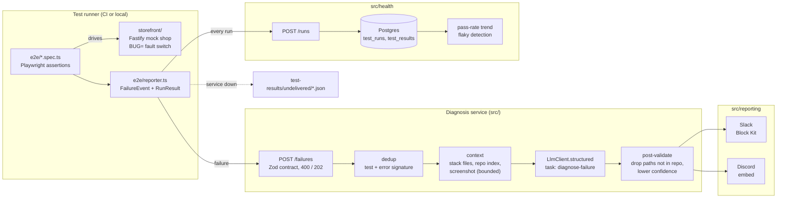

# Autonomous E-Commerce QA Agent

Deterministic Playwright checks find the failure; an AI agent explains it and files a structured bug report to team chat.

## Why this exists

E2E suites are good at saying *that* something broke and bad at saying *why*. The
person on call gets a red build, a stack trace pointing at a spec file, and a
screenshot, then spends the first twenty minutes working out which part of the app
to open. This project automates that first triage step: every failure is enriched with
the source files it touched, the browser console, and the screenshot, and an agent
proposes a root cause and the files to look at first. The report arrives in Slack or
Discord, deduplicated, with the raw evidence alongside it.

It ships with a small mock storefront with switchable, known bugs, so diagnosis
quality can be checked against ground truth instead of judged by eye.

## Architecture



| Folder | Role |
| --- | --- |
| `storefront/` | Mock shop: login, products, cart, checkout. One file per route; faults in `faults.ts`. |
| `e2e/` | Playwright specs, console-capture fixture, the custom reporter and its pure event builder. |
| `src/contracts/` | Zod schemas shared by both sides: `FailureEvent`, `RunResult`, `Diagnosis`. |
| `src/diagnosis/` | HTTP service, context gathering, prompt, post-validation, pipeline. |
| `src/reporting/` | `Notifier` interface, Slack and Discord builders (pure) and senders, dedup, webhook retry. |
| `src/health/` | Postgres store and pure metrics (pass-rate trend, flaky tests). |
| `src/llm/client.ts` | The only code that talks to the model provider. |
| `migrations/` | SQL schema. |
| `dashboard/` | Placeholder for the phase-2 Next.js dashboard. |

## Design principle: deterministic tests, AI diagnosis

**The AI never decides pass or fail.** Every verdict comes from a Playwright assertion
(`toHaveText('$49.97')`), which is deterministic, reviewable, and the same on every run.
The reporter observes results; it cannot change them. The model is used for one job:
explaining a failure that has already been decided. That keeps the cost of a wrong
model answer small (a less useful bug report) and keeps the test suite trustworthy.

Supporting rules:

- Model output is schema-validated (`Diagnosis` in `src/contracts/diagnosis.ts`) on the
  provider side and again on ours. Nothing unvalidated crosses `LlmClient`.
- Suspected files are checked against the repository index. Paths that do not exist are
  dropped and the confidence is lowered one level (to `low` if nothing grounded remains).
  The report states how many paths were removed.
- Error text, console logs and source code are treated as data. The system prompt tells
  the model to ignore instructions found in them.
- Context is bounded: at most 6 source files, 12 KB per file, 40 KB total, one screenshot
  up to 3 MB. The repo index is capped at 500 files.

## Failure handling

| Situation | Behaviour |
| --- | --- |
| Reporter builds an event that violates the contract | Builder throws; the reporter logs it and carries on. The test result is unaffected. |
| Diagnosis service unreachable or returns non-2xx | Reporter writes the payload to `test-results/undelivered/` and logs the path. Replaying the spool is on the roadmap. |
| Malformed event posted to `/failures` | `400` with Zod issues; nothing is diagnosed. |
| Model call fails, refuses, truncates, or returns off-schema output | Report is still sent, marked "AI diagnosis unavailable", with the raw assertion error. A failure is never dropped because the AI failed. |
| Model names files that do not exist | Paths removed, confidence lowered, count shown in the report. |
| Screenshot missing, unreadable, or too large | Diagnosis runs without it; the gap is logged. Typical in CI where runner and service do not share a disk. |
| Slack / Discord webhook errors | Network errors, `429` and `5xx` are retried 3 times with exponential backoff; `4xx` is not retried. With two channels, one failing does not block the other. |
| All channels fail | The dedup window is released so the next occurrence is reported instead of suppressed. |
| Same test fails the same way repeatedly | First occurrence is reported; repeats within `DEDUP_WINDOW_MINUTES` are counted and not sent. When the window closes, one follow-up message carries the occurrence count. Dedup runs before the model call, so repeats cost nothing. |
| Postgres down when a run is posted | `/runs` returns `503`; the reporter spools the run. Inserts are idempotent (`ON CONFLICT DO NOTHING`), so re-delivery is safe. |
| Unknown `BUG=` value | Storefront refuses to start, so a typo cannot produce a healthy-looking demo. |

Known limits: dedup state is in-process and lost on restart (worst case: one extra
report). Diagnosis runs in-process after the `202`; a crash mid-diagnosis loses that
diagnosis. Both are listed in the roadmap.

## Testing

```bash
npm run typecheck
npm test
```

Jest runs offline, with no browser and no API key. The model is replaced by `FakeLlm`
(`test/fakes.ts`), which still parses every response through the real schema.

| Suite | Covers |
| --- | --- |
| `failure-event-contract.test.ts` | Same fixtures through both sides of the contract: the reporter's builder produces valid events (ANSI stripped, attachments mapped), the service accepts them with `202` and rejects 8 malformed shapes with `400`. `/runs` and `/health/summary`. |
| `diagnosis.test.ts` | Stack-trace file extraction, bounded context, screenshot attached as an image block, hallucinated-path filtering and confidence downgrade, degraded report on bad model output, dedup before the model call. |
| `notifiers.test.ts` | Slack and Discord builders (snapshots), platform size limits, webhook retry policy, fan-out partial failure. |
| `dedup.test.ts` | Error signatures ignore volatile values; window, suppression and follow-up counts. |
| `health-metrics.test.ts` | Pass rate per run (final attempt wins, skips excluded), flaky = passed and failed on the same commit. |
| `storefront.test.ts` | Via `fastify.inject`: correct checkout total, and wrong total with `BUG=checkout-total`; the other two faults. |
| `llm-contract.test.ts` | Schema enforcement at the LLM boundary; image content blocks. |

The Playwright suite (`npm run e2e`) needs browsers (`npx playwright install chromium`).
CI runs it as a separate job in `.github/workflows/ci.yml`.

## Running locally

Requirements: Node 22+, Docker (for Postgres).

```bash
cp .env.example .env               # optional: SLACK_WEBHOOK_URL, DISCORD_WEBHOOK_URL, ANTHROPIC_API_KEY
npm ci
npx playwright install chromium
docker compose up -d postgres
npm run db:migrate

npm run diagnosis                  # terminal 1: diagnosis service on :4000
npm run e2e                        # terminal 2: green run against the healthy storefront
BUG=checkout-total npm run e2e     # terminal 2: checkout fails, a report is produced
```

With no webhook configured, reports go to the diagnosis service log. Available faults:
`checkout-total`, `add-to-cart-noop`, `login-rejects-valid` (see `storefront/faults.ts`
for where each one lives). The storefront alone: `npm run storefront`.

The scripted 60-second demo (inject bug, run e2e, report lands in Slack) is in
[`scripts/demo-loop.md`](scripts/demo-loop.md).

## Results

Not yet measured. The table below is what will be reported once the evaluation runs;
no numbers here should be read as achieved.

| Metric | How it will be measured | Result |
| --- | --- | --- |
| Diagnosis accuracy on seeded bugs | Share of runs per fault in `storefront/faults.ts` where the top suspected file is the known root-cause file | not yet measured |
| Hallucinated-path rate | Share of suggested paths dropped by post-validation | not yet measured |
| Time to report | Failure timestamp to chat delivery, p50 / p95 | not yet measured |
| Duplicate suppression | Reports sent vs failures received over a week of scheduled runs | not yet measured |

## Roadmap

1. Evaluation harness: run each seeded fault N times and fill in the Results table.
2. Agentic second pass: let the model request specific files (tool use) instead of seeing only stack-trace files and the index.
3. CI artifact access: upload screenshots and traces, pass URLs in the event so diagnosis works when runner and service are on different machines.
4. Spool replay command for `test-results/undelivered/`.
5. Durable queue and dedup state in Postgres, so restarts lose neither.
6. Scheduled runs against a staging URL (the "continuously running" part), with flaky tests reported separately from regressions.
7. Phase 2 dashboard (`dashboard/`) on top of `/health/summary`.
