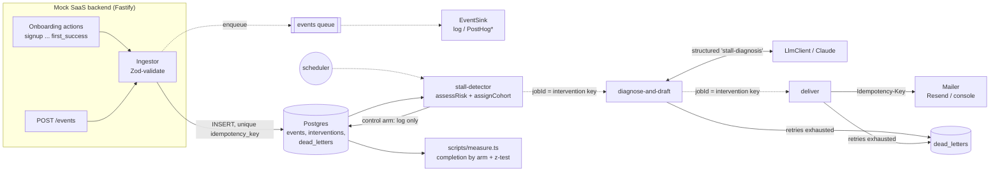

# Automated Onboarding & Retention Engine

Tracks new-user behaviour in a SaaS app, spots users who stall during onboarding, drafts an AI-written recovery email grounded in their actual event trail, sends it exactly once, and measures intervention vs control.

## Why this exists

Most SaaS products lose a large share of signups before the first moment of value. The usual fixes are either a generic drip campaign (cheap, mostly ignored) or a human reviewing each stuck account (useful, doesn't scale). This project sits in between:

- **Rules decide who is stuck.** Stall detection is a pure, versioned function you can unit test and explain to a PM. The model never decides who gets contacted.
- **The model decides what to say.** It reads the trail ("card declined twice, then silence for three days") and drafts a specific message. Every claim must cite real event ids, and anything ungrounded is rejected.
- **The loop is closed.** A hash-based control group is assessed by the same rules and never emailed, so the effect can be measured instead of assumed.

The headline engineering concern is **trust in the plumbing**: no event lost at ingestion, no user emailed twice for the same stall, and no failure dropped silently.

## Architecture



Dashed arrows are BullMQ queues. `*` = adapter skeleton. Step-by-step flow: [docs/sequence.md](docs/sequence.md).

| Path | What lives there |
|---|---|
| `src/events/` | Zod event schema (`schema.ts`), `EventStore` (Postgres + in-memory), `EventSink` (log, PostHog skeleton), `Ingestor` |
| `src/app/` | Fastify mock backend: onboarding actions with deterministic failure inputs (`tok_chargeDeclined`, `token: "expired"`, ...) |
| `src/workers/` | `assessRisk` rules, stall-detector, diagnose-and-draft, deliver, dead-letter handler, BullMQ entrypoint |
| `src/interventions/` | Intervention key, repository interface, Postgres + in-memory implementations |
| `src/experiment/` | Cohort assignment, two-proportion z-test, completion-by-arm measurement |
| `src/queue/` | Queue-agnostic retry/dead-letter core (`runAttempt`), BullMQ adapter, `InlineQueue` for tests |
| `src/llm/client.ts` | The only path to the model (Anthropic SDK, structured outputs) |
| `scripts/` | `migrate.ts`, `simulate.ts` (synthetic users), `measure.ts` |
| `migrations/` | SQL schema, including the uniqueness constraints the guarantees rely on |

### Stall rules (v1)

From `src/workers/assess-risk.ts`. The user's *next step* is the first one they haven't completed.

| Signal | Condition | Weight |
|---|---|---|
| `inactive` | No event of any kind for at least the step's window (verify_email 24h, create_project 48h, invite_teammate 72h, add_payment 72h, first_success 96h) | +0.50 |
| `long_inactive` | ...for at least 2x the window | +0.25 |
| `repeated_failures` | 2 or more failures on the next step | +0.50 |
| `failed_attempt` | exactly 1 failure on the next step | +0.20 |

A user is stalled when the score is at least 0.5, which means they have gone inactive or keep failing on the step they're stuck at. Changing any threshold means bumping `version`.

## Failure handling

| Concern | Mechanism | Covered by |
|---|---|---|
| **Event loss at ingestion** | Validate first, then a durable `INSERT`, then the 202. Enqueueing downstream comes after the write and is best-effort. The stall detector reads Postgres directly, so a Redis outage delays analytics but can't hide a stall. | `test/ingestion.test.ts` |
| **Duplicate events** | Client `Idempotency-Key` is stored under a `UNIQUE (idempotency_key)` constraint. A retry returns the original event id with `200`. Reusing a key for a *different* event returns `409` rather than being silently merged. | `test/ingestion.test.ts`, `test/integration/` |
| **Duplicate emails** | Intervention key = `userId \| stalledAtStep \| ruleVersion`, which serves as the **Postgres primary key**, the **BullMQ jobId** and the **provider idempotency key**. Status changes are conditional updates (`pending -> drafted -> sent`). A `sent` record is never re-sent, and a later scan of the same stall finds the existing row. | `test/intervention-idempotency.test.ts`, `test/integration/` |
| **Transient failures** | Every job gets 5 attempts with exponential backoff (2s, 4s, 8s, 16s). Errors that retrying can't fix (`PermanentJobError`, e.g. 4xx from Resend, unknown user) skip the retries. | `test/dead-letter.test.ts` |
| **Dead letters** | On the final attempt, `runAttempt` writes a `dead_letters` row and freezes the intervention as `dead_lettered` *before* rethrowing. It's never silently dropped and never retried by a later scan. Production BullMQ and the test `InlineQueue` share this code path. | `test/dead-letter.test.ts` |
| **LLM output** | Zod schema (SDK structured outputs, then a second parse on our side). Then a grounding check: every `evidence[].eventId` must exist in the user's trail, and the email must use the `{{first_name}}` token. Rejected output is retried and then dead-lettered, and is never saved or sent. | `test/diagnosis.test.ts`, `test/llm-contract.test.ts` |
| **Control contamination** | Control records are written as `control_logged`. A DB `CHECK` stops a control row from ever reaching a send state, and `deliver` refuses control users as a second line of defence. | `test/intervention-idempotency.test.ts` |
| **PII / prompt injection** | The prompt contains event types, enum reasons and timestamps only. Names and emails stay in `users` and are substituted at send time. No free-text user input reaches the model. | `test/diagnosis.test.ts` |

**Known residual risk:** a crash after the provider accepts an email but before `markSent` commits leads to a retry. That retry carries the same provider idempotency key, so Resend's 24h dedupe absorbs it. A provider without idempotency keys would reopen this window.

## Testing

```bash
npm run typecheck
npm test                 # offline: no Postgres, Redis or API key needed
```

| Suite | What it proves |
|---|---|
| `events-schema` | Typed events accept valid input, reject unknown types, failure reasons and non-UTC timestamps |
| `ingestion` | Zero event loss at the HTTP boundary: N accepted requests give exactly N stored events, retries are deduped, conflicts get 409, and a broken queue doesn't lose the event |
| `assess-risk` | Each rule, thresholds, score capping, order independence |
| `diagnosis` | Diagnosis contract with `FakeLlm`, including rejection of evidence that cites non-existent event ids |
| `intervention-idempotency` | The same stall processed repeatedly or concurrently, or a replayed deliver job, sends exactly once. Control arm is never emailed |
| `dead-letter` | Retry, then recover; retry, then dead letter (send and diagnosis); permanent errors skip retries |
| `experiment` | Cohort determinism and split, z-test against a hand-computed example, completion-by-arm |
| `test/integration/` | Real Postgres uniqueness under concurrent writes. **Skipped unless `INTEGRATION=1`** |

## Running locally

```bash
cp .env.example .env
docker compose up -d                 # postgres:17, redis:7
npm install
npm run migrate
npm run dev                          # API on :3000
npm run workers                      # stall-detector, diagnose, deliver, events workers
```

Walk a user into a stall:

```bash
curl -XPOST localhost:3000/signup -H 'content-type: application/json' \
  -H 'idempotency-key: demo-signup-1' -d '{"email":"ada@example.test","name":"Ada"}'
# then, using the returned userId, fail payment twice:
curl -XPOST localhost:3000/users/$USER_ID/payment-methods -H 'content-type: application/json' \
  -H 'idempotency-key: demo-pay-1' -d '{"cardToken":"tok_chargeDeclined"}'
```

Without `RESEND_API_KEY`, emails print to stdout. Without an Anthropic credential the diagnose job fails, retries and ends up in `dead_letters`, which is a handy way to watch the dead-letter path against real BullMQ.

Synthetic experiment, fully offline:

```bash
npm run simulate -- --users 2000 --seed 42 --uplift 0.10 --mail-failure-rate 0.2
npm run measure -- data/synthetic-run.json
```

The simulator runs the real scan, cohort, diagnose, deliver and measure code over in-memory stores. Without `--llm` it uses a clearly labelled template drafter in place of the model. It injects transient mail failures and repeated scans so it can exercise idempotency.

> **Note on the CI workflow:** `.github/workflows/ci.yml` lives in this folder so the project can be split into its own repo. GitHub only runs it once that split happens.

## Results

**Not yet measured.** The table will be filled from runs whose provenance is stated next to each figure.

| Metric | Intervention | Control | Data | Status |
|---|---|---|---|---|
| Onboarding completion among flagged users | – | – | synthetic (`simulate.ts`) | not yet measured |
| Difference (two-proportion z-test, p-value) | – | – | synthetic | not yet measured |
| Duplicate-send rate (keys with >1 delivered email) | – | n/a | synthetic, with injected mail failures | not yet measured |
| Dead-lettered interventions | – | n/a | synthetic | not yet measured |

On synthetic data, recovery rates are **simulator inputs** (`--base-recovery`, `--uplift`). A synthetic completion difference only shows the measurement pipeline recovers a known effect. It says nothing about whether the emails work on real users.

## Roadmap

- [ ] Fill `docs/annotated-journey.md` from a `--llm` synthetic run
- [ ] Transactional outbox for the analytics forward (today best-effort after the durable write)
- [ ] Implement `PostHogSink` (self-hosted PostHog or Segment), deduped on event id
- [ ] Exercise `ResendMailer` against a Resend test key, and add bounce/complaint webhooks feeding back as events
- [ ] Treat missing LLM credentials as a `PermanentJobError` (fail fast instead of burning retries)
- [ ] Dead-letter review endpoint: list, replay (with a new attempt counter), resolve
- [ ] Offline eval set for `stall-diagnosis`: grounding rate, tone, and "no invented offers" via LLM judge plus human spot checks
- [ ] Frequency cap across stalls (e.g. at most one email per user per 72h) and an unsubscribe link
- [ ] Sequential testing / minimum sample size calculator, so the experiment isn't peeked at
- [ ] Minimal static frontend for the mock onboarding flow
