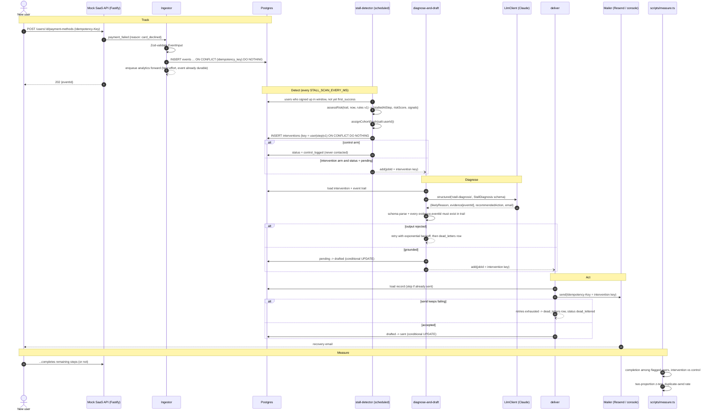

# Detect -> diagnose -> act -> measure

One stall, end to end. Solid arrows are synchronous calls; dashed arrows are queue hand-offs (BullMQ in production, `InlineQueue` in tests and the simulator).

